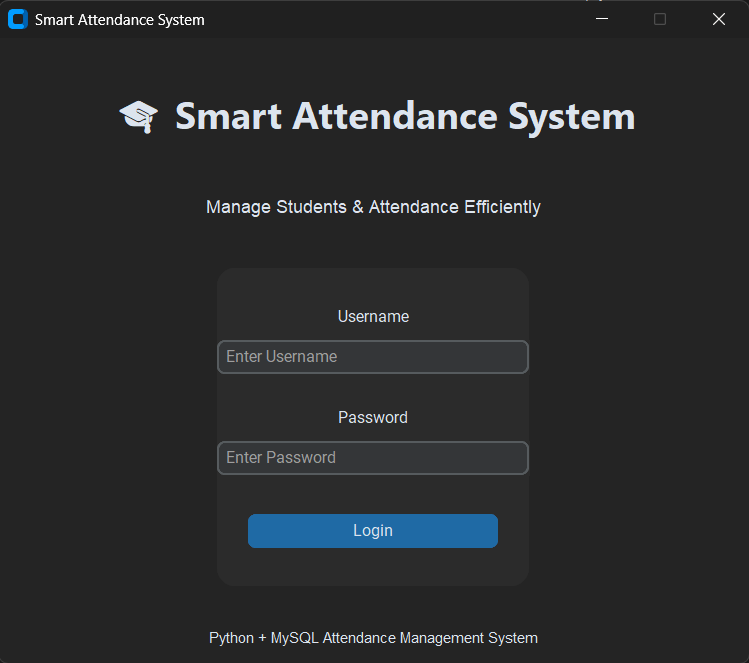
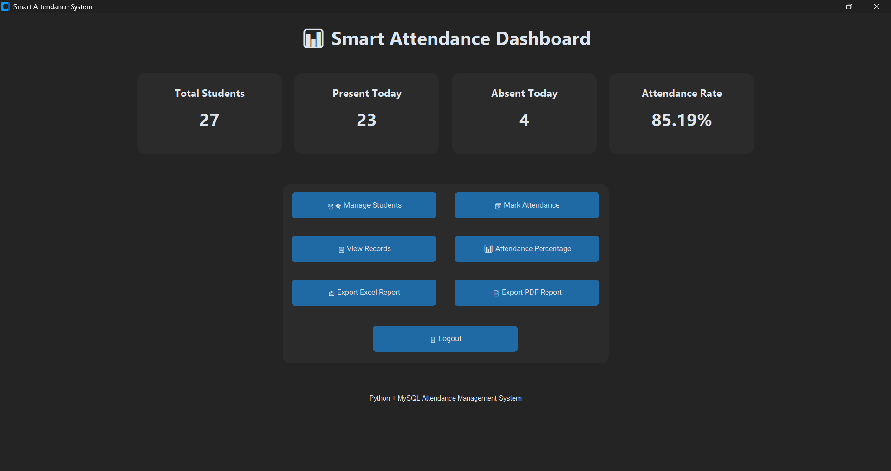
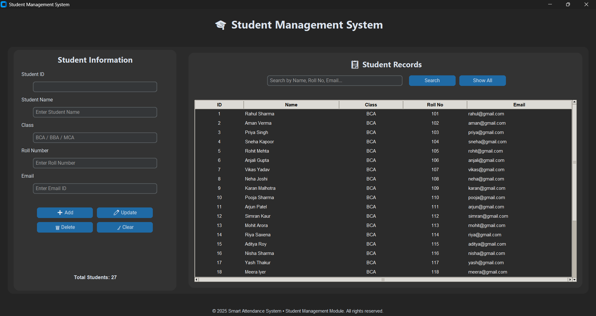
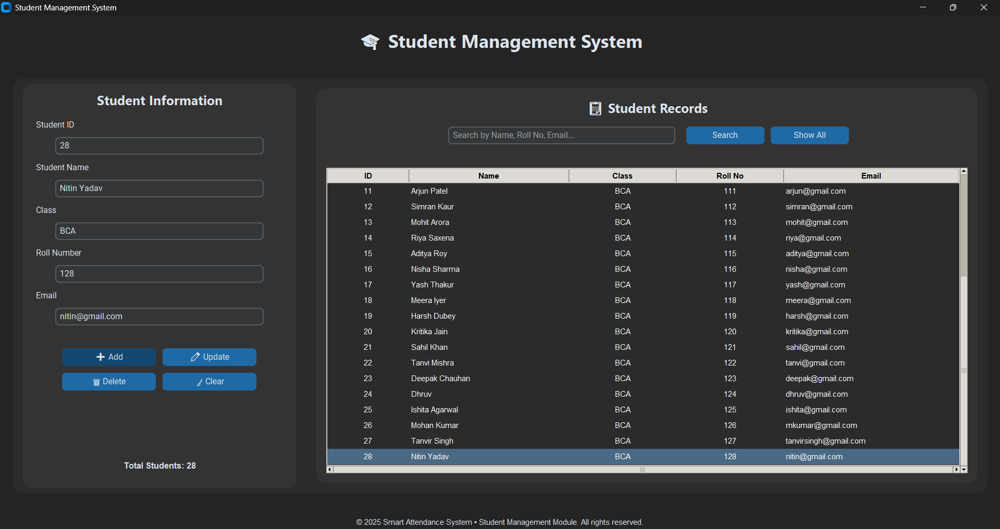
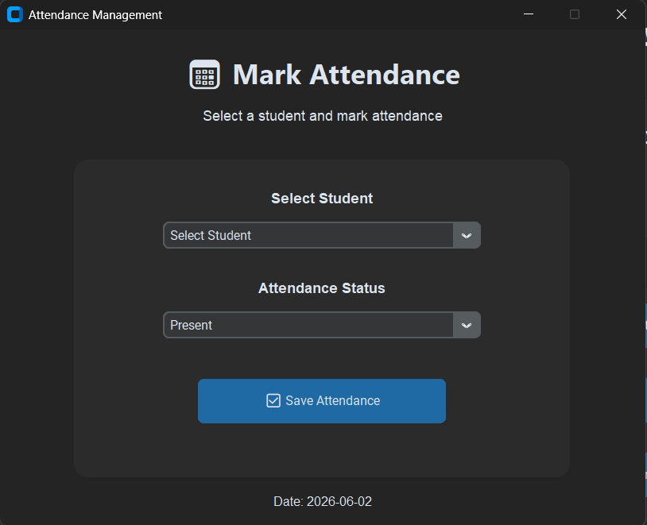
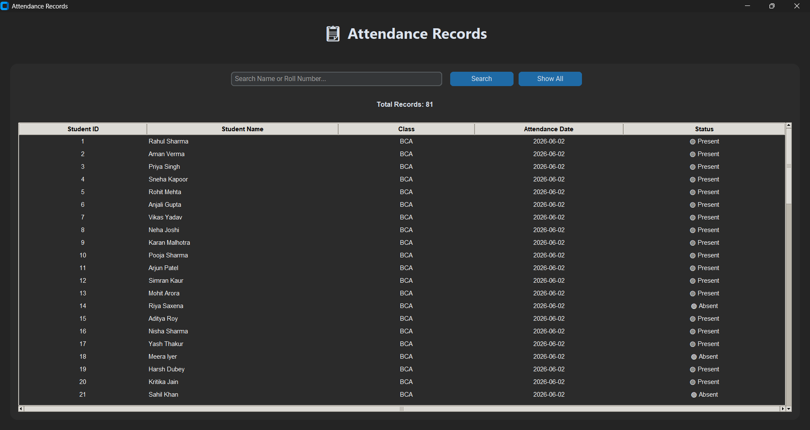
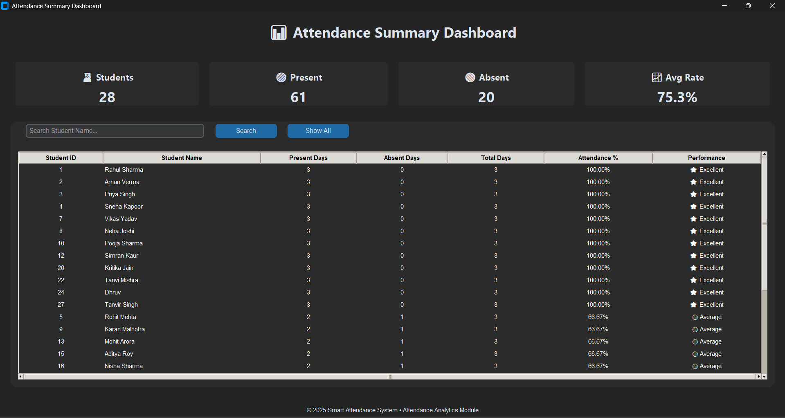
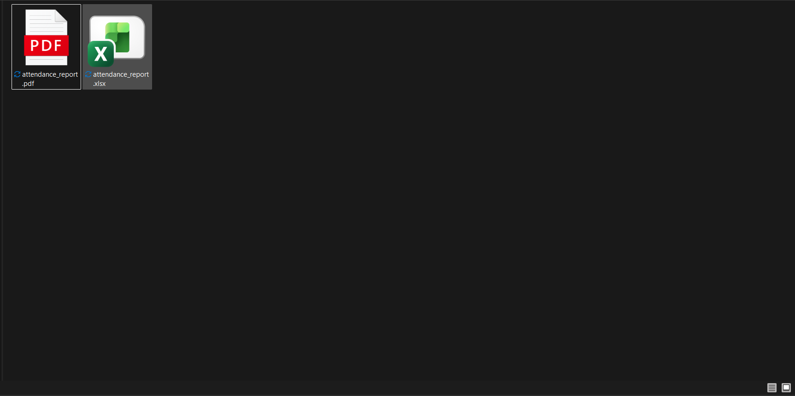

# 🎓 Smart Attendance Management System

A modern desktop-based Attendance Management System developed using **Python, CustomTkinter, and MySQL**. The application enables teachers to efficiently manage student records, mark daily attendance, analyze attendance performance, and generate professional reports in both Excel and PDF formats.

Designed with a modern dark-themed user interface, the system combines database management, analytics, and reporting into a single easy-to-use desktop application.

---

## 📌 Project Overview

Managing student attendance manually can be time-consuming, error-prone, and difficult to analyze over time. This project provides a digital solution that allows institutions and teachers to:

- Maintain student records
- Mark daily attendance
- Track attendance performance
- Analyze attendance trends
- Export attendance reports
- Improve record management efficiency

The application is built with a professional graphical interface using CustomTkinter and uses MySQL for secure data storage.

---

# ✨ Key Features

## 🔐 Secure Login System

- Teacher authentication
- Username and password validation
- Protected access to the system

---

## 👨‍🎓 Student Management

- Add new students
- Update student information
- Delete student records
- Search students instantly
- View complete student database

---

## 📋 Attendance Management

- Mark attendance as Present or Absent
- Prevent duplicate attendance entries
- Daily attendance tracking
- Student-wise attendance records

---

## 📊 Attendance Analytics Dashboard

- Total students overview
- Present days count
- Absent days count
- Attendance percentage calculation
- Performance classification
- Attendance summary table

---

## 📑 Report Generation

### Excel Reports

- Export attendance data to Excel
- Professional spreadsheet format
- Easy sharing and record keeping

### PDF Reports

- Export attendance data to PDF
- Printable report format
- Professional report layout

---

## 🎨 Modern User Interface

- Built using CustomTkinter
- Dark mode interface
- Responsive layout
- Professional dashboard design
- User-friendly navigation

---

# 🛠️ Technology Stack

| Technology | Purpose |
|------------|----------|
| Python | Application Logic |
| CustomTkinter | Modern GUI Development |
| MySQL | Database Management |
| MySQL Connector | Database Connectivity |
| Pandas | Data Processing |
| OpenPyXL | Excel Report Generation |
| ReportLab | PDF Report Generation |
| Tkinter Treeview | Data Tables |

---

# 📂 Project Structure

```text
Smart-Attendance-System/
│
├── assets/
│
├── database/
│   └── attendance_system.sql
│
├── reports/
│   ├── attendance_report.xlsx
│   └── attendance_report.pdf
│
├── screenshots/
│   ├── 01_login_page.png
│   ├── 02_dashboard.png
│   ├── 03_student_management.png
│   ├── 04_add_student.png
│   ├── 05_mark_attendance.png
│   ├── 06_attendance_records.png
│   ├── 07_attendance_summary.png
│   └── 08_reports.png
│
├── login.py
├── dashboard.py
├── manage_students.py
├── attendance.py
├── view_attendance.py
├── attendance_percentage.py
├── export_report.py
├── pdf_report.py
├── database.py
│
├── requirements.txt
├── README.md
└── .gitignore
```

---

# 🗄️ Database Design

## Teachers Table

```sql
teacher_id INT PRIMARY KEY AUTO_INCREMENT
username VARCHAR(50) UNIQUE
password VARCHAR(100)
```

### Purpose

Stores teacher login credentials.

---

## Students Table

```sql
student_id INT PRIMARY KEY AUTO_INCREMENT
name VARCHAR(100)
class VARCHAR(50)
roll_no VARCHAR(20) UNIQUE
email VARCHAR(100)
```

### Purpose

Stores student information.

---

## Attendance Table

```sql
attendance_id INT PRIMARY KEY AUTO_INCREMENT
student_id INT
attendance_date DATE
status VARCHAR(10)
```

### Purpose

Stores daily attendance records.

---

# 🚀 Installation Guide

## 1️⃣ Clone Repository

```bash
git clone https://github.com/yourusername/Smart-Attendance-System.git
```

---

## 2️⃣ Open Project Directory

```bash
cd Smart-Attendance-System
```

---

## 3️⃣ Create Virtual Environment

```bash
python -m venv .venv
```

Activate Environment:

### Windows

```bash
.venv\Scripts\activate
```

### Linux / macOS

```bash
source .venv/bin/activate
```

---

## 4️⃣ Install Dependencies

```bash
pip install -r requirements.txt
```

---

## 5️⃣ Create Database

Open MySQL Workbench or MySQL Command Line.

Import:

```text
database/attendance_system.sql
```

---

## 6️⃣ Configure Database

Open:

```python
database.py
```

Update credentials:

```python
host="localhost"
user="root"
password="YOUR_PASSWORD"
database="attendance_system"
```

---

## 7️⃣ Run Application

```bash
python login.py
```

---

# 📸 Application Screenshots

## Login Page



---

## Dashboard



---

## Student Management



---

## Add Student



---

## Mark Attendance



---

## Attendance Records



---

## Attendance Analytics Dashboard



---

## Reports



---

# 📈 System Workflow

```text
Login
   ↓
Dashboard
   ↓
Student Management
   ↓
Attendance Marking
   ↓
Attendance Records
   ↓
Attendance Analytics
   ↓
Excel / PDF Reports
```

---

# 🎯 Key Functionalities

### CRUD Operations

- Create Student
- Read Student Data
- Update Student Information
- Delete Student Records

### Attendance Tracking

- Daily attendance recording
- Student attendance history
- Attendance percentage calculation

### Analytics

- Present count
- Absent count
- Attendance percentage
- Performance evaluation

### Reporting

- Excel export
- PDF export
- Attendance summaries

---

# 🧠 Concepts Used

- Object-Oriented Programming (OOP)
- Database Connectivity
- SQL Queries
- CRUD Operations
- GUI Development
- Data Analysis
- Report Generation
- Exception Handling
- Event-Driven Programming

---

# 🎓 Learning Outcomes

This project helped in understanding:

- Python Application Development
- GUI Design using CustomTkinter
- MySQL Database Management
- Data Analytics
- Report Automation
- Professional Software Development Workflow
- Project Deployment and Documentation

---

# 🔮 Future Enhancements

The system can be extended with:

- Face Recognition Attendance
- Student Photo Profiles
- QR Code Attendance
- Email Notifications
- Attendance Charts & Graphs
- Multi-Teacher Support
- Cloud Database Integration
- Web-Based Version
- Mobile Application

---

# 👨‍💻 Author

### Sommay Dewat

BBA Student | Python Developer

**Skills Used:**

- Python
- MySQL
- CustomTkinter
- Data Analytics
- Report Generation
- Desktop Application Development

---

# ⭐ Project Highlights

✅ Modern Dark-Themed UI  
✅ Complete Attendance Management Solution  
✅ Database Integration with MySQL  
✅ Excel & PDF Report Generation  
✅ Attendance Analytics Dashboard  
✅ Professional Project Structure  
✅ Portfolio & Resume Ready

---

# 📄 License

This project is developed for educational, academic, and learning purposes.

Feel free to use, modify, and enhance the project for personal learning and educational projects.

---

### If you found this project useful, consider giving it a ⭐ on GitHub.